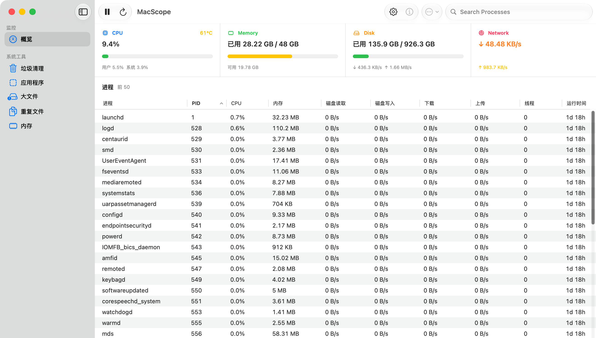

<p align="center">
  
</p>

<h1 align="center">MacScope</h1>

<p align="center">
  一款使用 SwiftUI 与 AppKit 构建的原生 macOS 系统监控、进程管理与维护工具。
</p>

<p align="center">
  <strong>macOS 13+</strong> · <strong>Apple Silicon / Intel</strong> · <strong>English / 简体中文</strong>
</p>

MacScope 将 CPU、温度、内存、磁盘和网络状态集中在原生窗口与菜单栏看板中，同时提供可排序的进程列表、进程详情，以及垃圾清理、应用卸载、大文件、重复文件和内存释放工具。原生应用独立运行，不依赖终端、Python、Textual 或 `uv`。

## 界面预览

### 系统概览与进程排行



### 垃圾扫描与选择性清理


### 应用扫描、状态与卸载


## 主要功能

### 实时系统概览

- 显示 CPU 总占用、用户占用、系统占用和 SoC 温度。
- 显示内存已用、总量、可用量和动态占用颜色。
- 显示数据卷已用/总容量，以及实时磁盘读取和写入速率。
- 显示实时网络下载和上传速率。
- 进度颜色会根据占用率、网速和温度区间动态变化。
- 支持暂停监控、立即刷新，以及 `0.5`、`1`、`2`、`5` 秒刷新频率。

### 进程监控与管理

- 默认显示 Top 20，可配置为 Top 5、10、20 或 50。
- 在一个表格中查看进程名称、PID、CPU、内存、磁盘读写、网络上下行、线程数和运行时间。
- 点击任意表头即可升序或降序排序。
- 按名称或 PID 搜索进程。
- 双击进程，或使用“进程信息”，打开右侧详情面板。
- 查看所选进程最近 1 分钟的 CPU、内存和 I/O 趋势。
- 在确认后正常退出或强制退出进程。

### 菜单栏看板

- 使用随浅色/深色菜单栏自动变化的单色监控图标。
- 菜单栏可只显示图标，也可紧凑显示最多三个实时指标。
- 点击图标可查看 CPU、内存、磁盘、网络、温度的最近 1 分钟趋势。
- 可显示按 CPU、内存、磁盘或网络排序的 Top 进程，并从菜单栏直接打开进程详情。
- 可在“设置 > 菜单栏”中启用、隐藏、选择指标、调整模块顺序和进程数量。
- 关闭主窗口后，菜单栏监控仍可继续运行。

### 系统维护工具

| 工具 | 能力 |
| --- | --- |
| 垃圾清理 | 扫描用户缓存、日志、诊断报告和开发者文件，逐项选择后清理 |
| 应用卸载 | 选择单个应用，同时检查其 Bundle ID、相关数据和其他已安装副本 |
| 大文件 | 在自定义文件夹中查找超过指定阈值的文件 |
| 重复文件 | 通过大小和内容哈希确认重复文件，并确保每组至少保留一份 |
| 内存释放 | 请求 macOS 释放符合条件的非活跃文件缓存，不会关闭正在运行的应用 |

所有扫描和删除操作都会显示具体路径、当前项目、总体进度和每一项的处理结果。失败项目会保留原因，并可在权限问题解决后重试。

### 原生 macOS 体验

- SwiftUI/AppKit 原生窗口、工具栏、表格、菜单、系统设置和标准授权对话框。
- 可调整大小、全屏显示，并支持跟随系统、浅色和深色外观。
- 原生半透明侧栏，可单独启用并调整透明度。
- 系统、石墨色和高对比度三套主题；系统主题跟随 macOS 强调色。
- English 为默认语言，可切换为简体中文。
- 两套无底座 Dock 图标，可在设置中即时切换并持久化。
- 应用内帮助、关于、作者主页和项目主页入口。

## 系统要求

### 运行应用

- macOS 13 Ventura 或更高版本。
- 支持 Apple Silicon 和 Intel Mac。
- 温度读取依赖本机可用的 IOHID 传感器。部分机型或 macOS 版本可能显示“不可用”，不影响其他监控功能。
- 原生应用不需要安装 Python、Textual、Homebrew 或其他运行时。

### 从源码构建

- 推荐 Xcode 16 或匹配的 Swift 6 工具链。
- 已安装 Xcode Command Line Tools：

```bash
xcode-select --install
```

## 安装

### 使用 DMG

1. 从 [Releases](https://github.com/shenmuoso/mac-scope/releases) 下载最新的 DMG。
2. 打开 DMG，将 `MacScope.app` 拖到 `Applications`。
3. 从“应用程序”启动 MacScope。

当前仓库生成的是 ad-hoc 签名的开发版本，尚未完成 Developer ID 公证。如果 Gatekeeper 阻止首次启动，请仅在确认构建来源可信的情况下，在 Finder 中右键应用并选择“打开”。

### 从源码运行

```bash
git clone git@github.com:shenmuoso/mac-scope.git
cd mac-scope
native/scripts/run_app.sh debug
```

脚本会编译、ad-hoc 签名并打开应用。产物位于：

```text
native/build/MacScope.app
```

只构建应用而不启动：

```bash
native/scripts/build_app.sh release
```

构建可分发的压缩 DMG：

```bash
native/scripts/build_dmg.sh release
```

默认输出：

```text
native/build/MacScope-0.4.7.dmg
```

也可以指定输出路径：

```bash
native/scripts/build_dmg.sh release ~/Desktop/MacScope.dmg
```

## 使用方法

### 查看系统与进程状态

1. 启动后进入“概览”。顶部显示 CPU、内存、磁盘和网络实时状态。
2. 在进程表中点击表头，按当前关注的资源排序。
3. 使用工具栏搜索框按进程名称或 PID 过滤。
4. 选择进程后点击“进程信息”，或直接双击该行，查看最近 1 分钟趋势。
5. 使用“进程操作”正常退出或强制退出进程。MacScope 不允许终止自身或 PID 1，macOS 也会阻止未获授权的受保护进程操作。

### 清理文件

1. 从侧栏进入垃圾、大文件或重复文件工具。
2. 点击扫描，等待路径和大小列表完成。
3. 检查每一项并选择需要移除的文件。
4. 确认后执行清理，并在当前页面查看逐项进度与结果。

大文件和重复文件默认扫描当前用户的 `Downloads`、`Desktop`、`Documents` 和 `Movies`。可以在“设置 > 清理 > 扫描文件夹”中修改。

### 卸载应用及残留

1. 进入“应用程序”，扫描标准应用目录。
2. 选择一个应用并打开卸载确认界面。
3. 检查主应用、相同 Bundle ID 的其他副本，以及检测到的相关数据。
4. 选择需要一并移除的项目后执行卸载。

MacScope 会先处理应用本体，再处理其相关数据。如果应用本体无法移除，相关数据不会被盲目删除。正在运行的应用需要先退出。

## 设置

设置使用 macOS `UserDefaults` 持久化，应用重启后仍会保留。

| 设置 | 可选值 | 默认值 |
| --- | --- | --- |
| 语言 | English、简体中文 | English |
| 刷新频率 | 0.5、1、2、5 秒 | 2 秒 |
| 进程行数 | 5、10、20、50 | 20 |
| 温度单位 | 摄氏度、华氏度 | 摄氏度 |
| 外观 | 跟随系统、浅色、深色 | 跟随系统 |
| 侧栏透明 | 开/关，0% 至 100% | 开，70% |
| 主题 | 系统、石墨色、高对比度 | 系统 |
| Dock 图标 | 简洁、详细 | 简洁 |
| 菜单栏显示 | 关闭、仅图标、紧凑数据 | 开启，紧凑数据 |
| 菜单栏指标 | CPU、内存、磁盘、网络、温度，最多 3 项 | CPU、内存 |
| 菜单栏进程 | 排序指标、3/5/8/10 行 | CPU，5 行 |
| 缓存处理 | 移到废纸篓、永久删除 | 移到废纸篓 |
| 清理前确认 | 开/关 | 开 |
| 大文件阈值 | 100 MB、500 MB、1 GB、5 GB | 500 MB |
| 重复文件最小值 | 1 MB、10 MB、100 MB、500 MB | 10 MB |

原生设置由系统保存在：

```text
~/Library/Preferences/com.shenmuoso.macscope.plist
```

“还原所有设置”会恢复上表默认值。扫描结果、文件选择和破坏性操作确认只在当前会话中保留。

Dock 图标选择会立即影响当前运行应用的程序坞和应用切换器图标。macOS 不提供类似 iOS 的可替换 Bundle 图标机制，因此 Finder 中的应用文件始终使用默认“简洁”图标。

## 权限与安全

- 所有系统数据均在本机采集和处理，MacScope 不上传监控数据。
- 文件默认移到废纸篓，MacScope 不会自动清空废纸篓。
- 只有可重建缓存和开发者文件在选择“永久删除”时会直接删除；应用、残留、大文件和重复文件仍移到废纸篓。
- 某些用户资源库路径需要“完全磁盘访问权限”。可以从“设置 > 清理 > 权限”直接打开系统设置。
- 移除受保护的 `/Applications` 应用或释放文件缓存时，MacScope 会使用标准 macOS 管理员授权对话框。
- MacScope 不显示自己的密码输入框，也不会读取或保存管理员密码。
- 扫描时会跳过符号链接和应用包内部，避免越过用户选择的目录边界。

## 数据说明与限制

- macOS 允许多核进程的 CPU 占用超过 100%。
- 磁盘和网络速率由两次采样之间的计数差计算，因此首次采样显示为 0。
- 进程网络速率依赖 macOS 提供的本机进程网络统计，受系统权限和采样可用性影响。
- 温度仅在当前硬件和系统暴露可用传感器时显示。
- 当前开发构建使用 ad-hoc 签名，适合本地测试，不等同于已公证的公开发行版本。

## 开发

直接编译 Swift Package：

```bash
swift build --package-path native --configuration debug
```

主要目录：

```text
native/
├── Package.swift                 Swift Package 定义
├── Resources/                    图标、Info.plist 与本地化资源
├── Sources/MacScopeNative/       SwiftUI/AppKit 原生应用
└── scripts/                      App 与 DMG 构建脚本

src/macscope/                     早期 Textual 终端版本
tests/                            终端版本测试
```

### 早期终端版本

仓库仍保留基于 Python/Textual 的终端版本，供兼容和历史参考。它不是当前原生应用的运行依赖。

```bash
uv sync
uv run macscope
```

终端版本需要 Python 3.11 或更高版本，以及支持 Unicode 和 256 色的终端。

## 项目地址

- Repository: <https://github.com/shenmuoso/mac-scope>
- Author: <https://github.com/shenmuoso>
