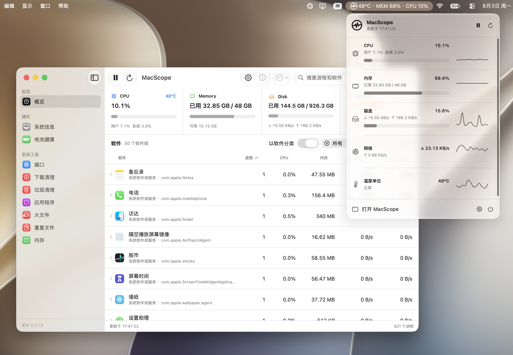

# MacScope v0.4.10

MacScope 0.4.10 把系统监控扩展为更完整的 Mac 状态与维护工具。本次版本新增系统硬件信息、电池健康、端口占用和下载文件夹清理，并重新整理了主界面、设置、菜单栏看板和任务结果展示。

## 新增功能

### 系统硬件信息

- 集中显示 Mac 型号、型号标识符、芯片、架构、CPU 核心、内存、macOS 版本、运行时间和系统热状态。
- 查看内置与外接显示器的分辨率、像素分辨率和主显示器状态。
- 查看 USB 设备、蓝牙控制器及已连接设备。
- 查看 Wi-Fi 接口、连接状态、信号、传输速率和信道等信息。
- 对 macOS 或当前机型未公开的数据明确显示为不可用，不使用估算值替代。

### 电池健康看板

- 显示当前电量、电源来源和实时充放电功率。
- 查看最大容量、设计容量、电池健康状态和循环次数。
- 展示满充容量、剩余容量、电压、电流和温度等电气信息。

### 端口占用工具

- 列出当前 TCP 与 UDP 监听端口、监听地址、PID、进程和所属软件。
- 支持按端口、进程和协议筛选。
- 支持复制地址、打开本机 HTTP 地址、查看进程详情和结束进程。

### 下载文件夹清理

- 分类识别安装包、压缩包、不完整下载、旧文件、大文件和重复下载。
- 重复下载通过内容哈希确认，并确保每组至少保留一份。
- 提供“推荐选择”、全选和按类别筛选，执行前始终由用户确认。
- 所选文件移到废纸篓，不会自动永久删除或清空废纸篓。

## 界面与体验

- 主界面和设置改用更接近 macOS 系统设置的分栏结构、原生侧栏材质与统一图标比例。
- 侧栏透明度可调；标题栏和内容区域保持系统窗口背景，不受侧栏透明设置影响。
- 菜单栏看板默认使用单色样式，并新增可选的“彩色模式”。颜色仅用于图表、温度、利用率和速率等动态状态。
- CPU、内存、磁盘和网络标题统一使用系统文字色，降低固定装饰色对信息层级的干扰。
- 清理和卸载任务完成后显示紧凑摘要；逐项状态、完整路径、失败原因和权限处理入口移动到独立结果窗口。
- 设置中的通用、菜单栏、外观、清理、权限管理和关于入口采用与 macOS 语义对应的图标和配色。

## 修复与改进

- 修复系统信息页面在部分窗口布局下显示空白的问题。
- 文件夹访问失败后保留重新授权、管理扫描目录和再次扫描的入口。
- 下载清理、端口工具和系统信息页面统一为更稳定的原生滚动与内容布局。
- 完善中英文界面文案和权限恢复提示。

## 安装说明

1. 从 [GitHub Releases](https://github.com/shenmuoso/mac-scope/releases) 下载 `MacScope-0.4.10.dmg`。
2. 打开 DMG，将 `MacScope.app` 拖入“应用程序”文件夹。
3. 从“应用程序”启动 MacScope。

当前构建使用 ad-hoc 签名，尚未完成 Apple Developer ID 公证。如果 macOS 阻止首次打开，请进入“系统设置 > 隐私与安全”，在“安全性”区域选择“仍要打开”，再按系统提示确认。

## 系统要求

- macOS 13 Ventura 或更高版本。
- GitHub Release DMG 面向 Apple Silicon Mac。
- 温度、无线连接和部分硬件字段取决于当前机型及 macOS 是否公开对应数据。
